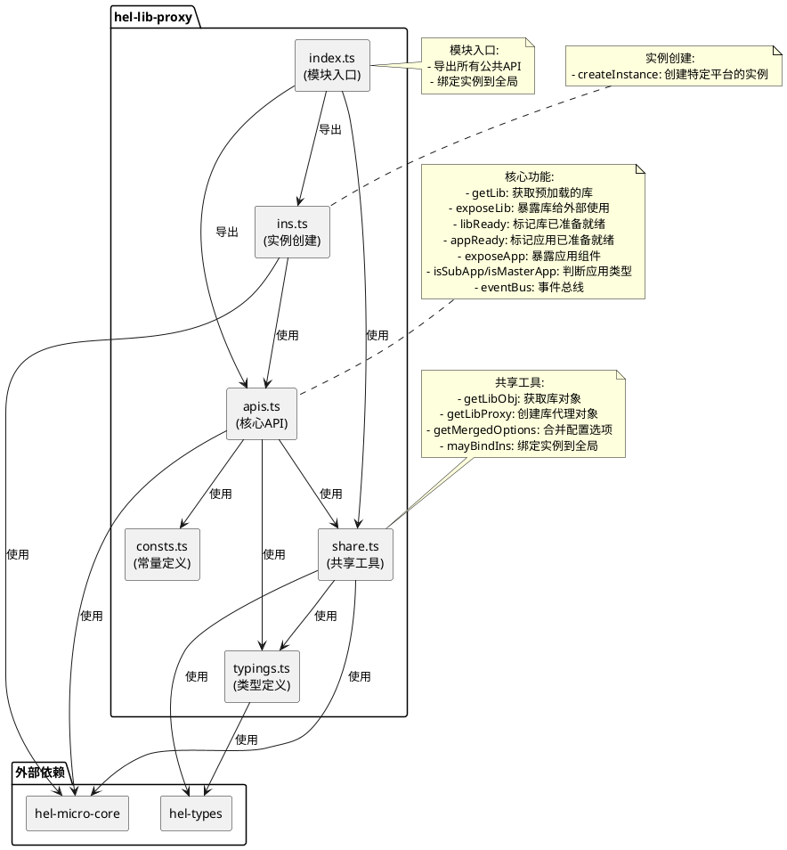

# hel-lib-proxy 模块架构说明

## 概述
`hel-lib-proxy` 是HEM微前端解决方案中的一个核心模块，用于帮助用户暴露库方法或属性。它独立于`hel-micro`，以减少打包体积并更独立地维护包代理逻辑。

## 架构图说明

## 模块详细说明

### index.ts (模块入口)
- 导出所有公共API
- 将实例绑定到全局对象`HelLibProxy`

### apis.ts (核心API)
包含以下主要功能：

1. **getLib**: 获取通过`preFetchLib`预加载的库
2. **exposeLib**: 暴露库给外部使用，在支持Proxy的环境下默认以代理对象暴露
3. **libReady**: 标记库已准备就绪，通常在模块提供方的入口文件加载完毕时调用
4. **appReady**: 标记应用已准备就绪
5. **exposeApp**: 暴露应用组件
6. **isSubApp/isMasterApp**: 判断当前运行环境是子应用还是主应用（已不推荐使用）
7. **eventBus**: 事件总线，用于模块间通信

### share.ts (共享工具)
包含以下工具函数：

1. **getLibObj**: 获取库对象
2. **getLibProxy**: 创建库代理对象，用于在支持Proxy的环境下安全访问模块
3. **getMergedOptions**: 合并配置选项
4. **mayBindIns**: 将实例绑定到全局对象

### ins.ts (实例创建)
- **createInstance**: 创建特定平台的实例，用于支持多平台场景

### consts.ts (常量定义)
- 定义模块版本号等常量

### typings.ts (类型定义)
- 定义TypeScript类型，包括库名称、库属性、配置选项等

## 数据流向
1. 用户通过`index.ts`访问模块功能
2. `index.ts`导出`apis.ts`中的核心API
3. 核心API调用`share.ts`中的共享工具函数
4. 工具函数与`hel-micro-core`和`hel-types`等外部依赖交互
5. `ins.ts`提供平台特定的实例创建功能
