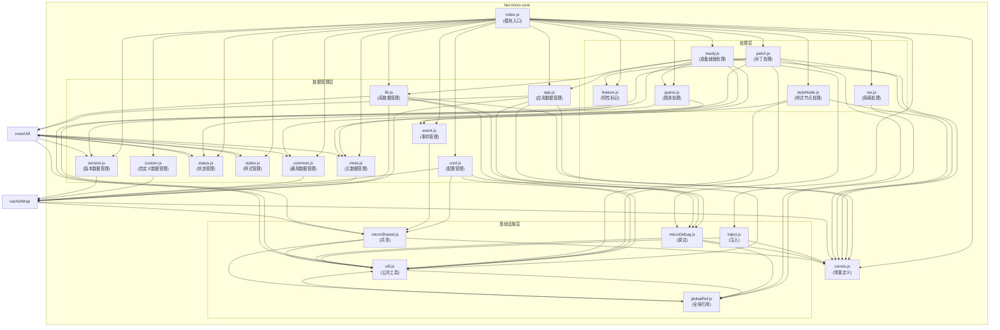

# hel-micro-core 模块架构说明

## 概述
`hel-micro-core` 是 HEM 微前端解决方案的核心模块，为 `hel-micro` 和 `hel-lib-proxy` 提供共享的基础功能。它包含了微前端架构的核心实现逻辑，如数据管理、事件处理、配置管理等。

## 架构图说明

## 模块详细说明

### index.js (模块入口)
- 导出所有公共API
- 初始化全局环境

### 数据管理层
包含以下数据管理模块：

1. **app.js**: 管理应用数据，包括应用组件、版本等信息
2. **lib.js**: 管理库数据，包括库属性、版本等信息
3. **meta.js**: 管理应用元数据
4. **conf.js**: 管理平台配置
5. **status.js**: 管理加载状态
6. **styles.js**: 管理样式字符串
7. **event.js**: 管理事件总线
8. **common.js**: 管理通用数据
9. **custom.js**: 管理自定义数据
10. **version.js**: 管理版本数据

### 处理层
包含以下处理模块：

1. **ready.js**: 处理应用和库的准备就绪状态
2. **guess.js**: 猜测应用名和版本
3. **iso.js**: 处理应用隔离相关逻辑
4. **patch.js**: 处理 DOM 补丁
5. **styleNode.js**: 处理样式节点
6. **feature.js**: 标记元素特性

### 基础设施层
包含以下基础设施模块：

1. **util.js**: 提供通用工具函数
2. **globalRef.js**: 管理全局引用
3. **inject.js**: 处理平台注入
4. **microDebug.js**: 提供调试和日志功能
5. **microShared.js**: 管理共享缓存和事件总线

### consts.js (常量定义)
- 定义常量和枚举

## 数据流向
1. 用户通过 `index.js` 访问模块功能
2. `index.js` 导出数据管理层和处理层的接口
3. 数据管理层和处理层依赖基础设施层提供的基础功能
4. 基础设施层提供全局共享的缓存和事件总线
