# hel-micro-core 业务流程说明

## 概述
本文档描述了 `hel-micro-core` 模块的主要业务流程，包括应用加载流程、库加载流程、配置流程和事件流程。

## 业务流程图说明

```mermaid
graph TB
    subgraph "hel-micro-core 业务流程"
        direction TB
        
        %% 应用加载流程
        subgraph "应用加载流程"
            direction LR
            preFetchApp["preFetchApp\n(预获取应用)"]
            setAppMeta["setAppMeta\n(设置应用元数据)"]
            appReady["appReady\n(标记应用准备就绪)"]
            getVerApp["getVerApp\n(获取应用组件)"]
            
            preFetchApp --> setAppMeta
            setAppMeta --> appReady
            appReady --> getVerApp
        end
        
        %% 库加载流程
        subgraph "库加载流程"
            direction LR
            preFetchLib["preFetchLib\n(预获取库)"]
            setAppMeta2["setAppMeta\n(设置库元数据)"]
            libReady["libReady\n(标记库准备就绪)"]
            getVerLib["getVerLib\n(获取库属性)"]
            
            preFetchLib --> setAppMeta2
            setAppMeta2 --> libReady
            libReady --> getVerLib
        end
        
        %% 配置流程
        subgraph "配置流程"
            direction LR
            initPlatformConfig["initPlatformConfig\n(初始化平台配置)"]
            getPlatformConfig["getPlatformConfig\n(获取平台配置)"]
            
            initPlatformConfig --> getPlatformConfig
        end
        
        %% 事件流程
        subgraph "事件流程"
            direction LR
            onEvent["eventBus.on\n(订阅事件)"]
            emitEvent["eventBus.emit\n(发射事件)"]
            
            onEvent --> emitEvent
        end
    end
    
    %% 流程间的关联
    style preFetchApp fill:#ffe4c4,stroke:#333
    style preFetchLib fill:#ffe4c4,stroke:#333
    style initPlatformConfig fill:#ffe4c4,stroke:#333
    style onEvent fill:#ffe4c4,stroke:#333
    
    style setAppMeta fill:#e0ffff,stroke:#333
    style setAppMeta2 fill:#e0ffff,stroke:#333
    style appReady fill:#e0ffff,stroke:#333
    style libReady fill:#e0ffff,stroke:#333
    style getVerApp fill:#e0ffff,stroke:#333
    style getVerLib fill:#e0ffff,stroke:#333
    style getPlatformConfig fill:#e0ffff,stroke:#333
    style emitEvent fill:#e0ffff,stroke:#333

```

## 详细流程说明

### 应用加载流程

1. **preFetchApp**: 预获取应用，从远程服务器获取应用的元数据和资源
2. **setAppMeta**: 设置应用元数据，将获取到的元数据存储到缓存中
3. **appReady**: 标记应用准备就绪，当应用的所有资源加载完成时调用
4. **getVerApp**: 获取应用组件，从缓存中获取指定版本的应用组件

### 库加载流程

1. **preFetchLib**: 预获取库，从远程服务器获取库的元数据和资源
2. **setAppMeta**: 设置库元数据，将获取到的元数据存储到缓存中
3. **libReady**: 标记库准备就绪，当库的所有资源加载完成时调用
4. **getVerLib**: 获取库属性，从缓存中获取指定版本的库属性

### 配置流程

1. **initPlatformConfig**: 初始化平台配置，设置平台相关的配置参数
2. **getPlatformConfig**: 获取平台配置，从缓存中获取平台配置信息

### 事件流程

1. **eventBus.on**: 订阅事件，注册事件监听器
2. **eventBus.emit**: 发射事件，触发已注册的事件监听器

## 数据流向
1. 用户调用预获取接口开始加载流程
2. 系统获取元数据并存储到缓存中
3. 资源加载完成后标记准备就绪状态
4. 用户通过获取接口从缓存中获取所需数据
5. 系统通过事件总线通知状态变化
