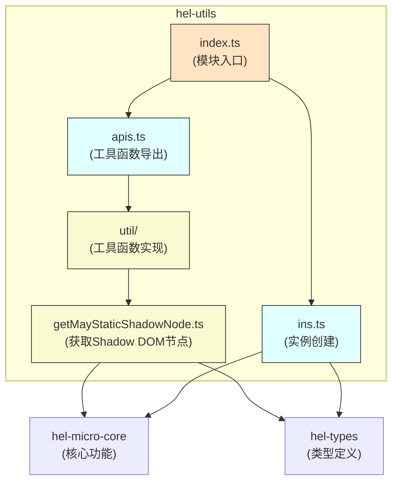

# hel-utils 模块架构说明

## 概述
`hel-utils` 是HEM微前端解决方案中的一个辅助工具模块，为 `hel-micro` 和 `hel-micro-core` 提供通用的工具函数。它包含了一些便捷的工具函数，特别是与 DOM 操作和平台实例创建相关的功能。

## 架构图说明

## 模块详细说明

### index.ts (模块入口)
- 导出所有公共API
- 导出 `getMayStaticShadowNode` 和 `createInstance` 函数

### apis.ts (工具函数导出)
- 导出工具函数 `getMayStaticShadowNode`

### ins.ts (实例创建)
- 提供 `createInstance` 函数用于创建平台实例
- 使用 `hel-micro-core` 的 `injectPlatToMod` 函数实现平台参数注入

### util/getMayStaticShadowNode.ts (工具函数实现)
- 实现 `getMayStaticShadowNode` 函数
- 当组件是被 hel-micro-react 等库使用 shadow-dom 渲染时，返回对应的处于 body 下的 shadow-dom 节点
- 通常用于为 UI 库弹层型组件设置挂载节点

## 依赖关系
1. `hel-utils` 依赖 `hel-micro-core` 提供的核心功能
2. `hel-utils` 依赖 `hel-types` 提供的类型定义
3. `ins.ts` 使用 `hel-micro-core` 的 `injectPlatToMod` 函数实现平台参数注入
4. `getMayStaticShadowNode.ts` 使用 `hel-micro-core` 的 `getCustomData` 和 `getGlobalThis` 函数

## 数据流向
1. 用户通过 `index.ts` 访问模块功能
2. `index.ts` 导出 `apis.ts` 和 `ins.ts` 中的功能
3. `apis.ts` 导出 `util/` 目录中的工具函数
4. 工具函数实现依赖 `hel-micro-core` 和 `hel-types` 提供的基础功能
