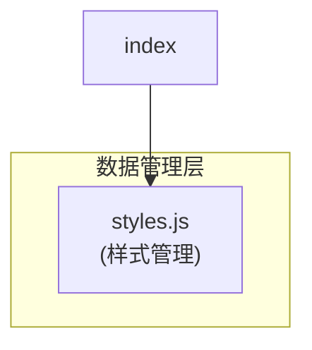
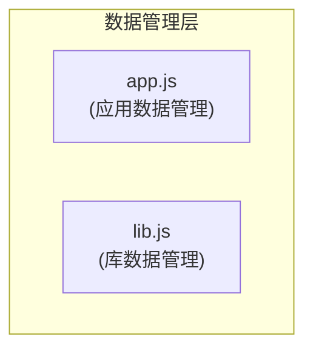
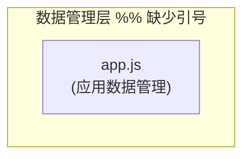
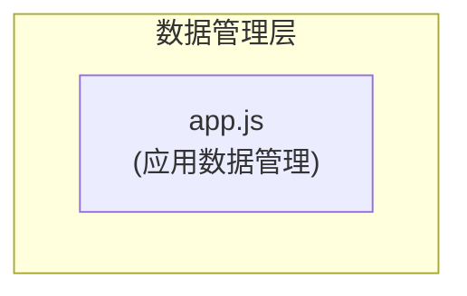
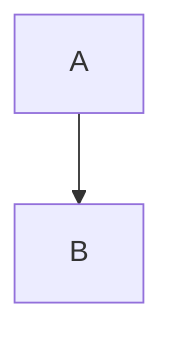

# Mermaid 图表语法错误常见场景和修复方案

## 概述
本文档总结了在使用 Mermaid 绘制图表时常见的语法错误场景及其修复方案，帮助开发者快速识别和解决图表渲染问题。

## 常见语法错误场景及修复方案

### 1. 变量名不一致错误

**问题描述**：
在图表中定义的节点变量名与后续引用的变量名不一致。

**错误示例**：
```mermaid
graph TB
    subgraph "数据管理层"
        styles["styles.js\n(样式管理)"]
    end
    
    %% 错误：引用了未定义的变量名
    index --> style
```

**修复方案**：
确保所有引用的变量名与定义的变量名完全一致。

**正确示例**：


### 2. 引号使用错误

**问题描述**：
在节点定义中错误使用引号，特别是在节点标签中包含特殊字符时。

**错误示例**：
```mermaid
graph TB
    style["style.js\n(样式管理)"]
```

**修复方案**：
使用方括号 `[]` 来定义包含特殊字符的节点标签。

**正确示例**：
```mermaid
graph TB
    style["style.js\n(样式管理)"]
```

### 3. 缩进不一致

**问题描述**：
图表中的缩进不一致可能导致解析错误。

**错误示例**：
```mermaid
graph TB
    subgraph "数据管理层"
        app["app.js\n(应用数据管理)"]
      lib["lib.js\n(库数据管理)"]  %% 缩进不一致
    end
```

**修复方案**：
保持一致的缩进，通常使用4个空格或一个制表符。

**正确示例**：


### 4. 子图表语法错误

**问题描述**：
子图表（subgraph）的定义语法不正确。

**错误示例**：


**修复方案**：
确保子图表标题使用引号包围。

**正确示例**：


### 5. 连接线语法错误

**问题描述**：
连接线的语法使用不正确。

**错误示例**：
```mermaid
graph TB
    A ==> B  %% 错误的连接线语法
```

**修复方案**：
使用正确的连接线语法。

**正确示例**：


### 6. 样式定义语法错误

**问题描述**：
样式定义中的语法错误。

**错误示例**：
```mermaid
style A fill:#ffe4c4,stroke:#333
```

**修复方案**：
确保样式定义语法正确。

**正确示例**：
```mermaid
style A fill:#ffe4c4,stroke:#333
```

### 7. 关键字冲突错误

**问题描述**：
使用了 Mermaid 的保留关键字作为变量名，例如 "style"。

**错误示例**：
```mermaid
graph TB
    subgraph "数据管理层"
        style["style.js\n(样式管理)"]  %% 使用了保留关键字 "style"
    end
    
    %% 这会导致解析错误，因为 "style" 是 Mermaid 的关键字
    style style fill:#ffe4c4,stroke:#333
```

**修复方案**：
避免使用 Mermaid 的保留关键字作为变量名，改用其他名称。

**正确示例**：
```mermaid
graph TB
    subgraph "数据管理层"
        styles["styles.js\n(样式管理)"]  %% 使用 "styles" 替代 "style"
    end
    
    %% 正确：使用非保留关键字的变量名
    style styles fill:#ffe4c4,stroke:#333
```

Mermaid 的保留关键字包括：
- `graph`
- `flowchart`
- `sequenceDiagram`
- `gantt`
- `classDiagram`
- `stateDiagram`
- `pie`
- `erDiagram`
- `journey`
- `requirementDiagram`
- `gitGraph`
- `mindmap`
- `timeline`
- `quadrantChart`
- `xychart`
- `sankey`
- `style`
- `class`
- `classDef`
- `click`
- `linkStyle`
- `direction`
- `subgraph`

## 调试技巧

### 1. 逐步验证
逐行检查图表代码，确保每一行都符合语法规范。

### 2. 使用在线编辑器
使用 Mermaid Live Editor (https://mermaid.live) 来实时预览和调试图表。

### 3. 查看错误信息
仔细阅读错误信息，通常会指出具体的错误行号和类型。

### 4. 简化图表
如果图表复杂，可以尝试简化图表来定位问题。

## 最佳实践

### 1. 保持一致性
- 使用一致的缩进
- 使用一致的变量命名规则
- 使用一致的引号风格

### 2. 清晰的命名
- 使用有意义的变量名
- 避免使用保留关键字作为变量名

### 3. 注释说明
- 使用注释说明复杂部分
- 在图表中添加必要的说明文字

### 4. 模块化设计
- 将复杂图表分解为多个子图表
- 使用清晰的层次结构

## 结论
通过遵循上述指导原则和修复方案，可以有效避免大部分 Mermaid 图表语法错误，提高图表的可读性和可维护性。
